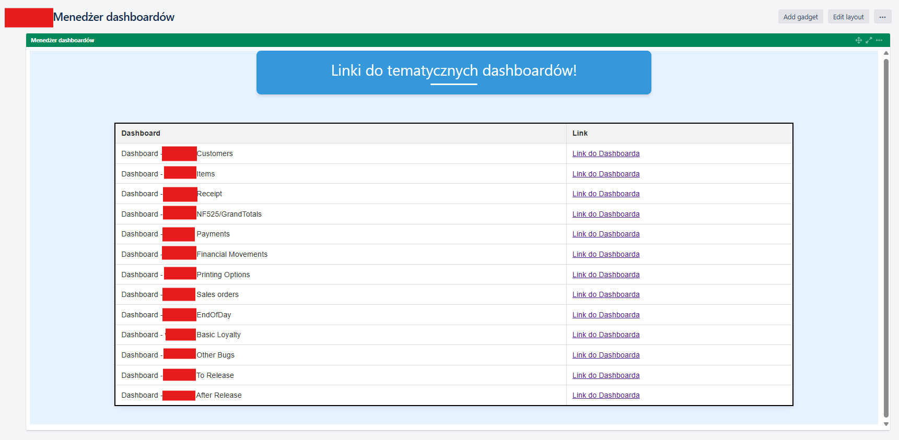
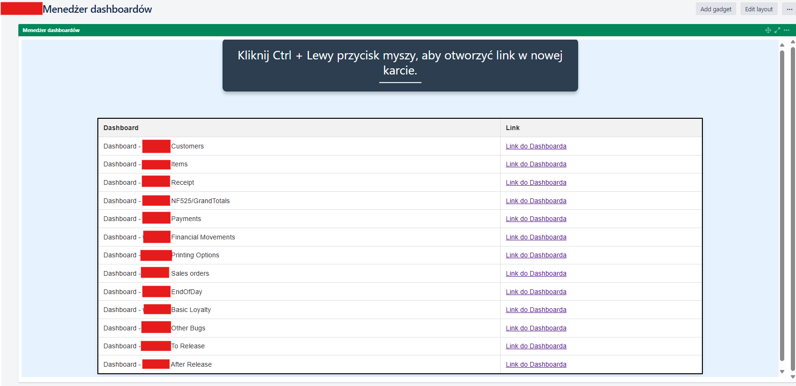
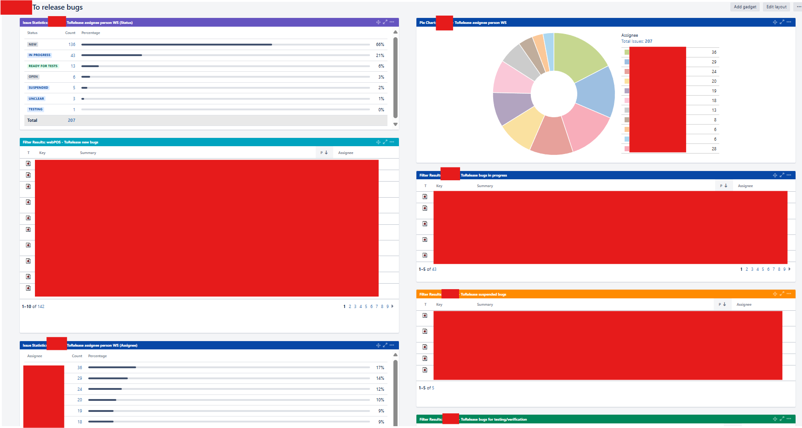
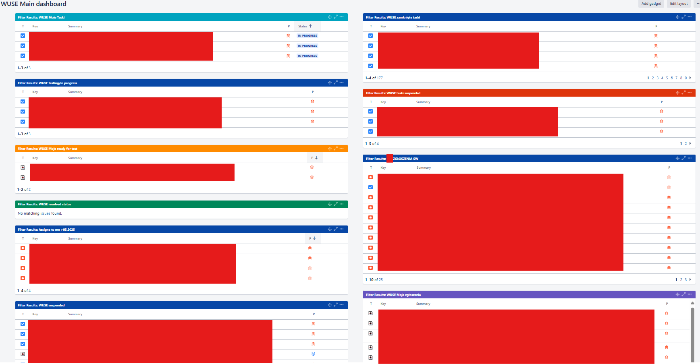

# Jira Showcase for Quality Assurance

Welcome to my repository\! Its purpose is to provide a practical demonstration of my advanced skills in using Jira to optimize Quality Assurance (QA) processes.

In my daily work, I believe that Jira is more than just a task-tracking system. It's a powerful data hub that, when used correctly, enables proactive quality management, rapid issue identification, and transparent team communication. Below, I present examples of how I leverage Jira's advanced features to achieve this.

-----

## 1\. Advanced JQL (Jira Query Language)

Smoothly navigating hundreds, or even thousands, of issues requires precision. That's why I create complex JQL queries daily to find the exact information I need in seconds. This is key to effective triaging, reporting, and monitoring the project's health.

#### Example 1: Finding Potential Regressions in the Latest Release

This query allows me to find all critical bugs reported after the last release deployment that are linked to tasks from that same release.

```jql
project = "webApplication" AND type = Bug AND status != "Closed" AND priority in (Critical, Blocker) AND created >= "2025-09-15" AND summary !~ "*SomeWord*" ORDER BY createdDate DESC
```

  * **Goal:** To quickly detect critical bugs.

#### Example 2: Monitoring "Forgotten" Bugs in a Critical Module

This query helps me identify bugs in the application's most important module (`component = "Payment"`) that have not been updated for over 10 days and are still unresolved.

```jql
project = "webApplication" AND component = "Payments" AND type = "Internal Bug" AND status not in (Resolved, Closed, "Ready for testing") AND updated <= "-10d" ORDER BY priority DESC
```

  * **Goal:** To proactively prevent important issues from getting stuck in the workflow and to remind the team about them.

#### Example 3: Finding All My Actionable Issues

A query I use on my personal dashboard to see all issues assigned to me that are currently in progress or waiting for my verification.

```jql
assignee = currentUser() AND status in ("In Progress", "Resolved", "Ready for test") ORDER BY updated DESC
```

  * **Goal:** To focus on priorities and tasks that actively require my intervention.

-----

## 2\. Data Visualization: Jira Dashboards

Raw data is hard to read. That's why I create custom dashboards that translate Jira data into understandable and actionable visualizations. They help both the entire team and me personally in our daily work.

### QA Team Dashboard – The Quality Command Center

This dashboard serves as the main source of information about the project's quality status for the entire team. It allows for a quick assessment of the situation and helps identify potential risks.
To manage the complexity of large projects, I also design a primary "Dashboard Hub". It acts as a central navigation point, aggregating key metrics for all application areas, covering both bugs and tasks. 
This approach allows any team member to quickly identify a topic of interest and then, with a single click, navigate to a dedicated, more detailed dashboard for instance, one focused on a specific functionality, pre release testing, or post release bugs.


*The screenshot above shows a team dashboard hub containing all other functional dasboards (written in html).*

Specific dashboard (linked to some function or type can be opened):


**Key Gadgets and Their Purpose:**

* **Bugs by Assignee Pie Chart:** Shows the current bug workload distribution across the team. This helps to identify potential bottlenecks and ensure that work is balanced effectively.
* **Newly Created Bugs Filter:** This acts as our team's inbox. It lists all recent bugs that need to be reviewed, prioritized, and assigned, ensuring no new issue is missed.
* **All Bugs by Priority Filter:** A master list of all open bugs, sorted from highest to lowest priority. This gadget ensures that the team is always focused on fixing the most critical issues first.
* **Issue Status Overview:** This gadget breaks down all bugs by their current status (e.g., "To Do", "In Progress", "In Review"). It provides a high-level view of our workflow and helps spot stages where issues might be getting stuck.

### My Personal Dashboard – Full Control Over My Tasks

This dashboard is my personal command center. I configure it to have all the tasks and bugs I'm responsible for at my fingertips. Thanks to it, nothing falls through the cracks, and I can effectively plan my workday.


*The dashboard above is configured to maximize my productivity and control over assigned tasks.*

**Key Gadgets and Their Purpose:**

  * **Assigned to Me Filter:** A simple list of all my open tasks, sorted by priority.
  * **Issues in Verification Filter:** Tasks that developers have marked as fixed and are awaiting my testing.
  * **Watched Issues Filter:** Important issues (not necessarily assigned to me) whose progress I want to track.

-----

Thank you for your time\! I hope this showcase effectively illustrates my practical approach to using Jira to ensure the highest software quality.
